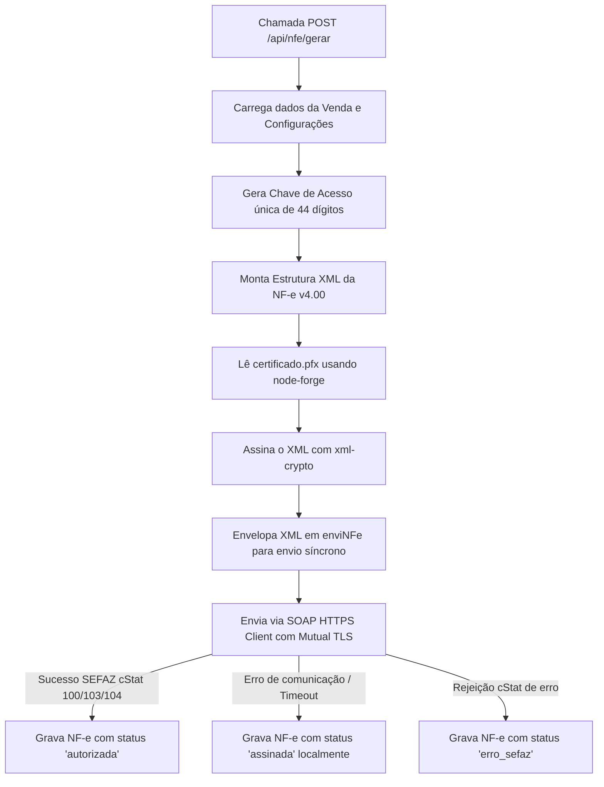

# 🧅 M&M Cebolas - Manual do Desenvolvedor


Este documento contém o guia completo de arquitetura, banco de dados, fluxos de API, emissão fiscal e desenvolvimento do sistema de controle de estoque, fluxo de caixa, gestão de acessos e emissão de Notas Fiscais Eletrônicas (NF-e) desenvolvido sob medida para a **M&M Cebolas**.

---

## 🏗️ Arquitetura Geral do Sistema

O sistema é dividido em duas partes integradas:

1. **Frontend (App Desktop/Electron):**
   - Roda via [Electron](file:///Users/caiorodrigues/Documents/M-M_cebolas_sistema/package.json), carregando arquivos locais estruturados como uma Single Page Application (SPA).
   - Estilização moderna construída em Vanilla CSS ([estilo_geral.css](file:///Users/caiorodrigues/Documents/M-M_cebolas_sistema/frontend/css/estilo_geral.css)) utilizando variáveis CSS customizadas, animações fluidas e elementos com Glassmorphism. O menu lateral conta com o verde forte oficial da marca em degradê, efeito de iluminação superior (*Ambient Mode*) e indicador de pílula branca ativa. O dashboard dispõe de KPIs premium com brilhos neons específicos, gráficos com curvas suavizadas, ranking de clientes/fornecedores com avatares automáticos e um demonstrativo DRE profissional destacado.
   - Comunicação assíncrona (`fetch`) com a API do servidor. O host da API é detectado dinamicamente: se rodando em ambiente local de desenvolvimento usa `http://localhost:3000/api`, se em produção aponta para `https://portalmmcebolas.com/api`.

2. **Backend (Node.js/Express & SQLite):**
   - Uma API REST robusta desenvolvida em [Express.js](file:///Users/caiorodrigues/Documents/M-M_cebolas_sistema/server/server.js).
   - Banco de dados relacional leve [SQLite3](file:///Users/caiorodrigues/Documents/M-M_cebolas_sistema/server/database.sqlite).
   - Módulo fiscal customizado ([nfe-service.js](file:///Users/caiorodrigues/Documents/M-M_cebolas_sistema/server/nfe-service.js)) para assinar XMLs com certificado digital A1 (.pfx) e transmitir diretamente para a SEFAZ de São Paulo (SP).
   - Sistema de logs integrado para todas as ações administrativas.

---

## 📁 Estrutura de Diretórios e Arquivos

Abaixo está o mapa completo dos arquivos e o papel de cada um deles:

- 📂 `/` (Raiz)
  - 📄 [dev.js](file:///Users/caiorodrigues/Documents/M-M_cebolas_sistema/dev.js) - Script de desenvolvimento que inicia o servidor Node.js, verifica a disponibilidade da porta 3000 e abre a janela do Electron apontando para o ambiente local. Ao encerrar o Electron, encerra o servidor backend automaticamente.
  - 📄 [package.json](file:///Users/caiorodrigues/Documents/M-M_cebolas_sistema/package.json) - Configuração do projeto principal (Electron e Empacotador `electron-builder`).
  - 📄 [DEPLOY.md](file:///Users/caiorodrigues/Documents/M-M_cebolas_sistema/DEPLOY.md) - Guia com os passos necessários para configurar o deploy automático via Git Hook na VPS.
  - 📄 [manual.md](file:///Users/caiorodrigues/Documents/M-M_cebolas_sistema/manual.md) - Este documento (manual geral do desenvolvedor).
  - 📄 [README.md](file:///Users/caiorodrigues/Documents/M-M_cebolas_sistema/README.md) - Visão geral do repositório e guia de instalação rápida.
- 📂 `certificado/`
  - 🔑 `certificado.pfx` - Certificado digital A1 da M&M Cebolas usado para assinar as notas fiscais eletrônicas.
- 📂 `server/`
  - 📄 [server.js](file:///Users/caiorodrigues/Documents/M-M_cebolas_sistema/server/server.js) - O ponto de entrada principal do backend. Define todos os endpoints da API REST, inicializa o banco SQLite3, manipula logs, gera PDFs de DANFE usando `jsPDF` e lida com autenticação JWT.
  - 📄 [nfe-service.js](file:///Users/caiorodrigues/Documents/M-M_cebolas_sistema/server/nfe-service.js) - Serviço de lógica fiscal. Carrega e decifra o certificado `.pfx`, assina digitalmente o XML usando `xml-crypto`/`node-forge`, empacota o lote e transmite via SOAP à SEFAZ SP.
  - 📄 [migrate_db.js](file:///Users/caiorodrigues/Documents/M-M_cebolas_sistema/server/migrate_db.js) - Script executado para criar e atualizar as tabelas do banco de dados (ideal para rodar em atualizações de produção).
  - 📄 [configurar_nfe.js](file:///Users/caiorodrigues/Documents/M-M_cebolas_sistema/server/configurar_nfe.js) - Script utilitário para cadastrar ou atualizar os dados fixos da empresa (CNPJ, Inscrição Estadual, endereço fiscal, ambiente, etc.) na tabela de configurações.
  - 📄 [atualizar_senha.js](file:///Users/caiorodrigues/Documents/M-M_cebolas_sistema/server/atualizar_senha.js) - Utilitário rápido para redefinir apenas a senha do certificado digital no banco de dados.
  - 📄 [reset_admin.js](file:///Users/caiorodrigues/Documents/M-M_cebolas_sistema/server/reset_admin.js) - Script utilitário para redefinir o usuário admin padrão (`admin` / senha: `123`).
  - 📄 [backup.js](file:///Users/caiorodrigues/Documents/M-M_cebolas_sistema/server/backup.js) - Realiza cópias de segurança do arquivo do banco SQLite, mantendo um histórico rotativo de no máximo 7 arquivos.
  - 📄 [ecosystem.config.js](file:///Users/caiorodrigues/Documents/M-M_cebolas_sistema/server/ecosystem.config.js) - Arquivo de configuração do PM2 para gerenciar o processo Node em produção na VPS.
  - 📄 [nginx-portalmmcebolas.conf.example](file:///Users/caiorodrigues/Documents/M-M_cebolas_sistema/server/nginx-portalmmcebolas.conf.example) - Exemplo de proxy reverso e SSL no Nginx para a VPS.
  - 📄 [package.json](file:///Users/caiorodrigues/Documents/M-M_cebolas_sistema/server/package.json) - Dependências do backend.
  - 🗄️ `database.sqlite` - Arquivo físico do banco de dados SQLite.
  - 📂 `backups/` - Diretório que armazena os arquivos de backup gerados.
- 📂 `frontend/`
  - 📄 [main.js](file:///Users/caiorodrigues/Documents/M-M_cebolas_sistema/frontend/main.js) - Script de entrada do Electron. Configura dimensões da janela, atalhos de controle da janela sem bordas (custom titlebar) e a lógica do autoUpdater.
  - 📂 `pages/`
    - 📄 [login.html](file:///Users/caiorodrigues/Documents/M-M_cebolas_sistema/frontend/pages/login.html) - Tela de login.
    - 📄 [home.html](file:///Users/caiorodrigues/Documents/M-M_cebolas_sistema/frontend/pages/home.html) - Layout principal do sistema que inclui a barra lateral de navegação e o contêiner de conteúdo principal dinâmico.
    - 📂 `sections/` (Templates HTML injetados dinamicamente no home.html)
      - 📄 [dashboard.html](file:///Users/caiorodrigues/Documents/M-M_cebolas_sistema/frontend/pages/sections/dashboard.html) - Painel principal com gráficos analíticos e cards de KPI.
      - 📄 [entrada.html](file:///Users/caiorodrigues/Documents/M-M_cebolas_sistema/frontend/pages/sections/entrada.html) - Lançamento de compras de mercadorias.
      - 📄 [saida.html](file:///Users/caiorodrigues/Documents/M-M_cebolas_sistema/frontend/pages/sections/saida.html) - Lançamento de vendas de mercadorias.
      - 📄 [estoque.html](file:///Users/caiorodrigues/Documents/M-M_cebolas_sistema/frontend/pages/sections/estoque.html) - Visualização de estoque físico.
      - 📄 [cadastro.html](file:///Users/caiorodrigues/Documents/M-M_cebolas_sistema/frontend/pages/sections/cadastro.html) - Gestão de clientes, fornecedores e variedades de cebolas.
      - 📄 [nfe.html](file:///Users/caiorodrigues/Documents/M-M_cebolas_sistema/frontend/pages/sections/nfe.html) - Histórico e controle de emissões fiscais.
      - 📄 [financeiro.html](file:///Users/caiorodrigues/Documents/M-M_cebolas_sistema/frontend/pages/sections/financeiro.html) - Detalhamento do caixa e despesas adicionais.
      - 📄 [config.html](file:///Users/caiorodrigues/Documents/M-M_cebolas_sistema/frontend/pages/sections/config.html) - Configurações locais do sistema.
      - 📄 [admin.html](file:///Users/caiorodrigues/Documents/M-M_cebolas_sistema/frontend/pages/sections/admin.html) - Painel de controle de acessos (Usuários) e logs (exclusivo Admin).
  - 📂 `js/`
    - 📄 [login.js](file:///Users/caiorodrigues/Documents/M-M_cebolas_sistema/frontend/js/login.js) - Controla a autenticação, a tela de transição com a barra de carregamento e toca o som de inicialização clássico.
    - 📄 [script.js](file:///Users/caiorodrigues/Documents/M-M_cebolas_sistema/frontend/js/script.js) - O motor central do frontend SPA. Implementa requisições à API, injeção dinâmica de páginas via fetch, renderização de gráficos do Chart.js, cálculo de estoque local, autocomplete de dados, e formatação de inputs.
  - 📂 `css/`
    - 📄 [estilo_geral.css](file:///Users/caiorodrigues/Documents/M-M_cebolas_sistema/frontend/css/estilo_geral.css) - Folha de estilos central do sistema.
    - 📄 [login.css](file:///Users/caiorodrigues/Documents/M-M_cebolas_sistema/frontend/css/login.css) - Estilo da página de autenticação.
  - 📂 `sounds/`
    - 🔊 `mac-startup.mp3` - Som de inicialização do sistema pós-login.
    - 🔊 `success-chime.mp3` - Som de confirmação de operações bem-sucedidas.

---

## 🗄️ Modelo de Banco de Dados (SQLite3)

O banco de dados armazena as seguintes tabelas estruturadas:

### 1. `usuarios`
Guarda os usuários que podem se logar no sistema.
- `id` (INTEGER, PK, AUTOINCREMENT)
- `label` (TEXT) - Nome de exibição do usuário (ex: "Vinicius").
- `username` (TEXT, UNIQUE) - Nome de usuário para login.
- `password` (TEXT) - Senha criptografada via BCrypt.
- `role` (TEXT) - Nível de permissão (`admin`, `chefe`, `funcionario`).

### 2. `produtos`
Variedades de cebolas e outros produtos comercializados.
- `id` (INTEGER, PK, AUTOINCREMENT)
- `nome` (TEXT) - Nome do produto (variedade).
- `ncm` (TEXT) - Nomenclatura Comum do Mercosul (ex: `07031019`).
- `preco_venda` (REAL) - Preço unitário base de venda.
- `cor` (TEXT) - Código hexadecimal para destaque visual na UI.
- `icone` (TEXT) - Nome da classe FontAwesome ou ícone customizado.
- `peso_por_caixa` (REAL, DEFAULT 20) - Peso médio padrão em Kg por caixa.

### 3. `clientes`
Cadastro de compradores das mercadorias.
- `id` (INTEGER, PK, AUTOINCREMENT)
- `nome` (TEXT) - Nome ou Razão Social.
- `documento` (TEXT, UNIQUE) - CPF ou CNPJ.
- `telefone` (TEXT)
- `ie` (TEXT) - Inscrição Estadual.
- `email` (TEXT)
- `endereco` (TEXT) - Endereço completo.

### 4. `fornecedores`
Cadastro de fornecedores (produtores de cebola).
- `id` (INTEGER, PK, AUTOINCREMENT)
- `nome` (TEXT)
- `documento` (TEXT, UNIQUE) - CPF ou CNPJ.
- `telefone` (TEXT)
- `ie` (TEXT)
- `email` (TEXT)
- `endereco` (TEXT)

### 5. `movimentacoes`
Fluxo de entrada e saída físico e financeiro (estoque e vendas).
- `id` (INTEGER, PK, AUTOINCREMENT)
- `tipo` (TEXT) - Tipo da movimentação (`entrada`, `saida`, `despesa`).
- `produto` (TEXT) - Nome do produto envolvido.
- `quantidade` (INTEGER) - Quantidade em caixas ou quilos dependendo da unidade.
- `valor` (REAL) - Valor total financeiro da movimentação.
- `descricao` (TEXT) - Detalhes ou observações.
- `data` (TEXT) - Data no formato ISO.
- `unidade` (TEXT, DEFAULT 'CX') - Unidade de medida (`CX`, `KG` ou `AMBOS`).
- `peso_kg` (REAL, DEFAULT 0) - Peso total em quilos calculado ou informado.
- `qtd_caixas` (INTEGER, DEFAULT 0) - Quantidade de caixas.
- `lote_id` (INTEGER) - ID de associação ao lote de origem (opcional).
- `custo_unitario` (REAL) - Custo unitário de compra (útil para cálculo de margem).

### 6. `nfe`
Controle de Notas Fiscais Eletrônicas emitidas e associadas às saídas.
- `id` (INTEGER, PK, AUTOINCREMENT)
- `venda_id` (INTEGER) - ID da movimentação de tipo `saida` associada.
- `chave_acesso` (TEXT) - Chave de 44 caracteres gerada automaticamente.
- `xml_content` (TEXT) - O conteúdo bruto do XML da nota (assinado digitalmente).
- `status` (TEXT) - Status fiscal (`assinada`, `autorizada`, `erro_sefaz`).
- `data_emissao` (TEXT) - Data de emissão.
- `numero_nfe` (INTEGER) - Número sequencial da NF-e.
- `serie_nfe` (INTEGER, DEFAULT 1) - Série da nota.
- `protocolo_autorizacao` (TEXT) - Protocolo de retorno da SEFAZ.

### 7. `configs`
Chaves e valores de configuração geral do sistema.
- `chave` (TEXT, PK)
- `valor` (TEXT)

### 8. `logs`
Auditoria de ações no sistema.
- `id` (INTEGER, PK, AUTOINCREMENT)
- `usuario_id` (INTEGER)
- `username` (TEXT)
- `acao` (TEXT) - Ex: `LOGIN`, `NFE_GERAR`, `MOVIMENTACAO`, `CADASTRO_DELETE`.
- `detalhes` (TEXT) - Descrição detalhada do que foi feito.
- `data` (TEXT) - ISO String.

---

## 🔐 Controle de Acesso e Segurança

O controle é feito via autenticação baseada em **JWT (JSON Web Tokens)**. Ao fazer login, um token é gerado com as informações do nível de acesso (`role`).

### Níveis de Permissão (Roles)

| Nível (Role) | Acesso |
| :--- | :--- |
| `funcionario` | Operações básicas: visualiza Dashboard, realiza lançamentos de Compra (`entrada`) e Venda (`saida`), lê Estoque e Cadastros. |
| `chefe` | Herda tudo de `funcionario` + Acesso às telas Financeiras e Notas Fiscais (emissão e consulta). |
| `admin` | Acesso total irrestrito: herda tudo de `chefe` + Visualização de logs de segurança, gestão de usuários (criar/editar/deletar logins) e Reset do Sistema (apagar dados). |

---

## 🔌 Referência de Endpoints (API REST)

Todas as chamadas (exceto `/api/login` e `/api/health`) requerem o cabeçalho HTTP `Authorization: Bearer <TOKEN_JWT>`.

### Autenticação e Monitoramento
- **`GET /api/health`**
  - Retorna o status do servidor e ambiente atual.
- **`POST /api/login`**
  - Recebe `{ username, password }`.
  - Retorna o Token JWT, dados do usuário e nível de acesso.

### Dashboard
- **`GET /api/dashboard`**
  - Calcula em tempo real o estoque de cada produto, o lucro/prejuízo mensal e geral, as últimas transações e gera as estatísticas para plotagem nos gráficos do Chart.js.

### Movimentações (Estoque/Fluxo)
- **`GET /api/movimentacoes`**
  - Lista todas as entradas, saídas e despesas financeiras em ordem decrescente de data.
- **`POST /api/movimentacoes`**
  - Cria uma nova movimentação. Faz o cálculo automático de peso baseando-se nas caixas lançadas ou vice-versa, de acordo com o `peso_por_caixa` do produto cadastrado.
- **`DELETE /api/movimentacoes/:id`**
  - Exclui uma movimentação.

### Produtos, Clientes e Fornecedores
- **`GET /api/produtos`** \| **`POST /api/produtos`** \| **`DELETE /api/produtos/:id`**
  - Cadastro de variedades de cebolas.
- **`GET /api/clientes`** \| **`POST /api/clientes`** \| **`DELETE /api/cadastros/cliente/:id`**
  - Cadastro de clientes.
- **`GET /api/fornecedores`** \| **`POST /api/fornecedores`** \| **`DELETE /api/cadastros/fornecedor/:id`**
  - Cadastro de fornecedores.

### Utilitários de Terceiros
- **`GET /api/consultar/CNPJ/:doc`**
  - Realiza consulta via API pública (ReceitaWS) para auto-preencher dados de novos clientes/fornecedores.

### Notas Fiscais (NF-e)
- **`GET /api/nfe`**
  - Retorna o histórico de notas fiscais emitidas (com opção de busca por nome/chave).
- **`POST /api/nfe/gerar`**
  - Recebe `{ venda_id, destinatario }`. Envia os dados para o `NFeService`, gera o XML, aplica a assinatura digital usando o certificado digital, armazena localmente e transmite à SEFAZ SP.
- **`POST /api/nfe/:id/transmitir`**
  - Tenta retransmitir uma nota que tenha ficado apenas com status `assinada` localmente.
- **`GET /api/nfe/:id/xml`**
  - Baixa o arquivo `.xml` assinado da nota.
- **`GET /api/nfe/:id/pdf`**
  - Gera dinamicamente e faz o download do documento **DANFE** formatado em PDF (contendo o código de barras CODE-128 e o QR Code fiscal de consulta no rodapé).
- **`DELETE /api/nfe/:id`**
  - Remove o registro da NF-e (Apenas `admin`).

### Configurações e Logs
- **`GET /api/configs`** \| **`POST /api/configs`**
  - Lê e grava parâmetros gerais. O método `GET` também decodifica dinamicamente o arquivo físico do certificado `.pfx` para obter o titular, validade e dias restantes para o vencimento.
- **`GET /api/logs`**
  - Lista os últimos 500 logs de auditoria (Apenas `admin`).
- **`DELETE /api/reset`**
  - Apaga dados transacionais de estoque, vendas, notas fiscais, clientes, fornecedores e logs (Apenas `admin`).

---

## 📄 Funcionamento da Emissão de NF-e (SEFAZ SP)

O módulo de NF-e ([nfe-service.js](file:///Users/caiorodrigues/Documents/M-M_cebolas_sistema/server/nfe-service.js)) realiza as seguintes etapas ao receber uma chamada para emissão:



### 1. Carregar o Certificado
Usa a biblioteca `node-forge` para descriptografar o arquivo PKCS#12 (`certificado.pfx`) usando a senha configurada no banco de dados. Extrai a chave privada e o certificado em formato PEM, necessários para realizar a assinatura digital e estabelecer a comunicação SSL.

### 2. Assinatura do XML
Com a biblioteca `xml-crypto`, o sistema calcula o digest SHA-1 e a assinatura RSA-SHA1 na tag `<infNFe>`. O certificado X.509 em formato base64 é injetado diretamente na tag `<X509Certificate>` dentro do elemento `<KeyInfo>`.

### 3. Transmissão Mutual TLS (SOAP)
A SEFAZ exige autenticação de cliente (Mutual TLS). O serviço utiliza a biblioteca `soap` e cria um cliente HTTP passando o certificado digital do usuário diretamente no túnel de comunicação do HTTPS:
```javascript
client.setSecurity(new soap.ClientSSLSecurityPFX(this.pfxPath, this.password));
```
O XML assinado é envelopado em uma chamada SOAP `nfeAutorizacaoLote` e enviado. A resposta é parseada regex-based para capturar tags como `<cStat>` (status da nota) e `<nProt>` (protocolo de autorização).

---

## 💻 Funcionamento do Frontend (SPA)

O frontend simula uma SPA nativa dentro do Electron:

1. **Janela Inicial (Electron):**
   - O [main.js](file:///Users/caiorodrigues/Documents/M-M_cebolas_sistema/frontend/main.js) cria a BrowserWindow sem barras nativas de janela (`frame: false`).
   - Carrega o arquivo [login.html](file:///Users/caiorodrigues/Documents/M-M_cebolas_sistema/frontend/pages/login.html).

2. **Transição de Login:**
   - Ao receber o retorno de sucesso do login, o [login.js](file:///Users/caiorodrigues/Documents/M-M_cebolas_sistema/frontend/js/login.js) aplica um efeito de desfoque (`blur`) no formulário, ativa uma tela de carregamento, toca o som clássico de boot do Mac (`sounds/mac-startup.mp3`) e incrementa uma barra de progresso horizontal em 3.8 segundos para então redirecionar para a página principal [home.html](file:///Users/caiorodrigues/Documents/M-M_cebolas_sistema/frontend/pages/home.html).

3. **Carregamento Dinâmico de Seções e Skeleton Loaders (Estilo YouTube):**
   - A navegação é feita chamando a função global `showSection(id)` presente em [script.js](file:///Users/caiorodrigues/Documents/M-M_cebolas_sistema/frontend/js/script.js).
   - O conteúdo do container principal é preenchido com o **Skeleton Loader** correspondente. O sistema utiliza um rastreador de sessão (`loadedSections = new Set()`) para determinar se a seção ou os dados específicos do dashboard já foram abertos anteriormente nesta sessão.
   - **Primeiro Acesso / Boot**: Exibe o esqueleto cinza com a animação de brilho deslizante (*shimmer wave*) por um atraso visual mínimo de **650ms** (seções em geral) ou **700ms** (dados do dashboard). Isso garante que o usuário consiga ver o layout se estruturando em conexões ultra-rápidas locais (localhost).
   - **Acessos Subsequentes**: O delay simulado é ignorado (definido como `0ms`) e os esqueletos não são re-injetados, garantindo carregamento instantâneo do HTML e inicialização dos dados já carregados para máxima performance durante a mesma sessão.
   - Um `fetch()` é feito para ler o arquivo `sections/${id}.html` e o resultado é injetado em `#main-content`.

4. **Verificação de Validade de Certificado e Visualizador de PDF (DANFE):**
   - Ao inicializar o sistema e carregar os dados globais, a função `checkCertExpiration()` calcula os dias restantes para o vencimento do certificado digital. Se faltarem menos de 45 dias, exibe um modal de alerta customizado (uma vez por dia, controlado via `localStorage`). O usuário pode gerenciar este alerta no menu de Configurações, onde também tem acesso aos detalhes do titular do certificado e à data de vencimento.
   - O visualizador de DANFE agora renderiza o PDF gerado diretamente dentro de um modal com `iframe` interno integrado na própria interface SPA, eliminando telas em branco ou problemas de popups bloqueados comuns no Electron e navegadores.

---

## ⚙️ Configuração, Desenvolvimento e Utilização Local

### Pré-requisitos
- Node.js v18 ou superior instalado.
- Git instalado.

### Configuração Inicial
1. Instale todas as dependências gerais e do backend executando o script automatizado na raiz:
   ```bash
   npm run install:all
   ```
2. Crie e configure o arquivo `.env` na pasta `server` com base no arquivo `.env.production.example`.

### Executando em Desenvolvimento
Para rodar a aplicação em desenvolvimento local com live sync, execute:
```bash
npm run dev
```
Isso aciona o script [dev.js](file:///Users/caiorodrigues/Documents/M-M_cebolas_sistema/dev.js) que subirá o servidor Express na porta 3000 e inicializará o Electron apontando para o ambiente de desenvolvimento local automaticamente.

### Resetando o Banco de Dados
Caso precise criar o banco de dados do zero ou realizar migrações, execute os scripts a partir da pasta `/server`:
```bash
cd server
node migrate_db.js     # Cria as tabelas do zero e aplica migrações de colunas novas
node configurar_nfe.js # Grava as variáveis básicas da M&M Cebolas no banco
```

---

## 🚢 Deploy Automático na VPS

O deploy do servidor de produção é feito de maneira totalmente automatizada usando um **Git Hook (post-receive)** na VPS. Isso elimina a necessidade de transferir arquivos manualmente (FTP/FileZilla).

Sempre que alterações no backend ou nas seções do frontend forem feitas localmente, publique-as executando:

```bash
git add .
git commit -m "Minhas melhorias e correções"
git push origin main  # Sincroniza o repositório no GitHub
git push vps main     # Dispara o deploy automático e atualiza a VPS em tempo real
```

*Consulte as etapas detalhadas de configuração da VPS no arquivo [DEPLOY.md](file:///Users/caiorodrigues/Documents/M-M_cebolas_sistema/DEPLOY.md).*

---
*Desenvolvido com excelência para a M&M Cebolas.*
